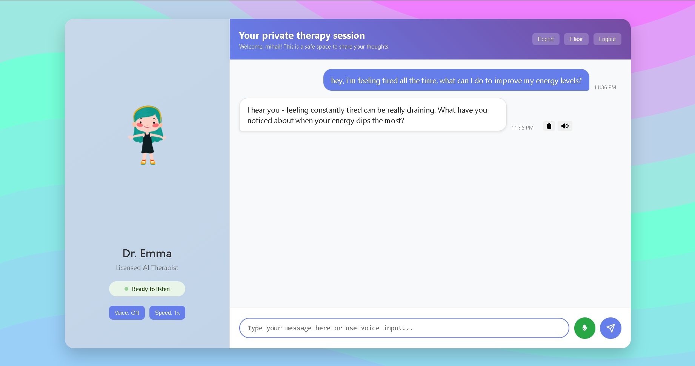
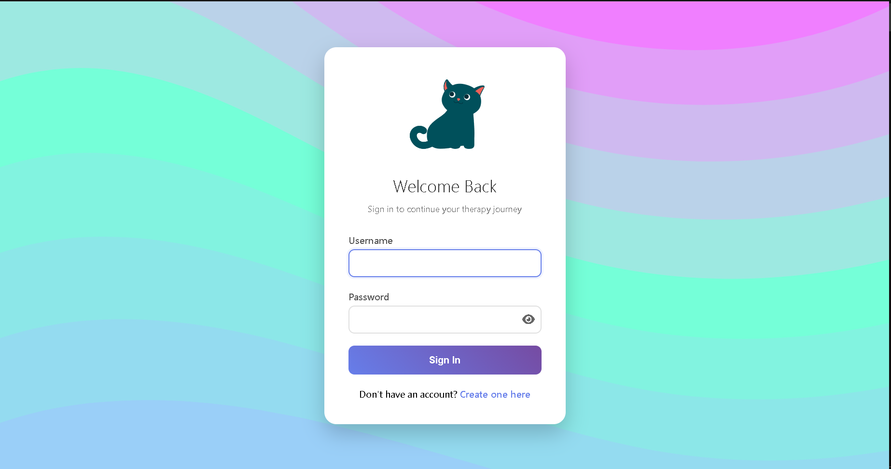
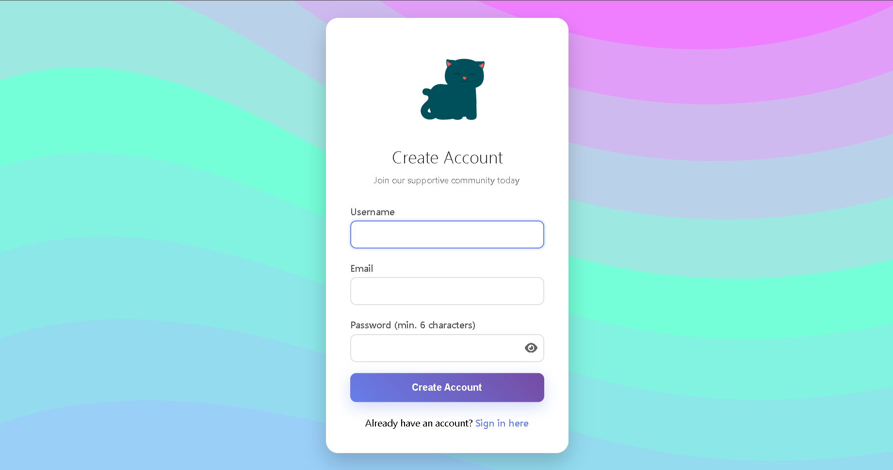

# AI Therapist Chatbot

A web-based therapist-like chatbot using Flask and DeepSeek v3 for NLP. Provides interactive mental health support.

## Features

- Interactive chatbot for mental health support
- Voice recognition and typing indicators for natural conversation flow
- Database integration for storing user interactions and session data
- Responsive design using HTML and CSS
- Built with Flask and Python backend

## Preview

## Technologies Used

- **Backend:** Python, Flask
- **Front-end:** HTML, CSS
- **NLP:** DeepSeek v3
- **Database:** SQLite 
- **Other:** Voice recognition APIs
